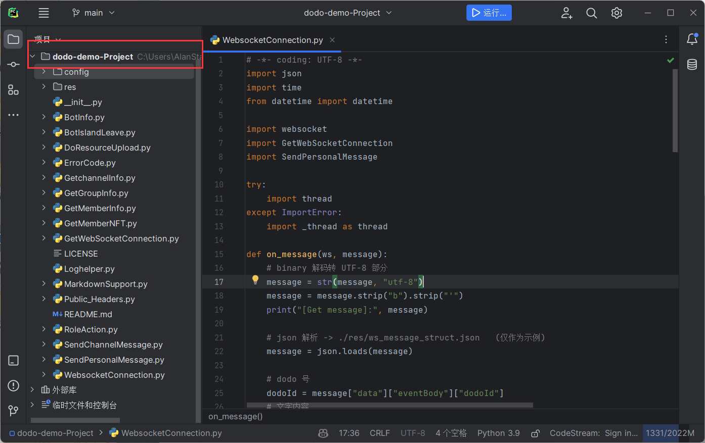
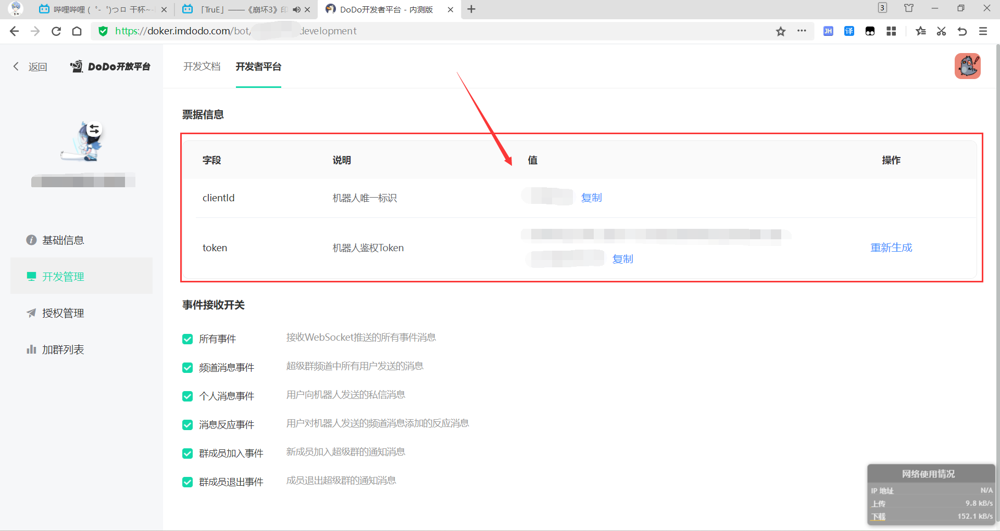
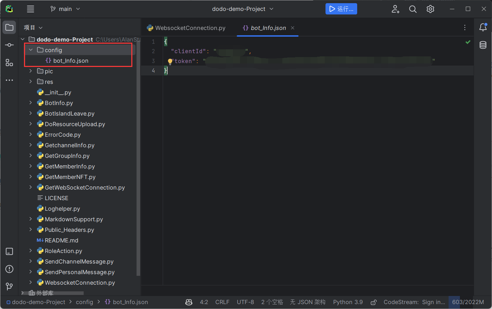
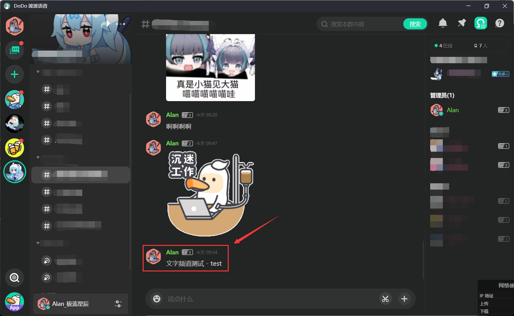
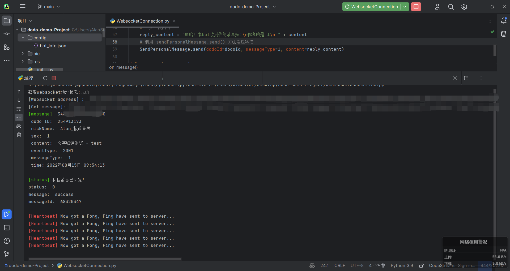
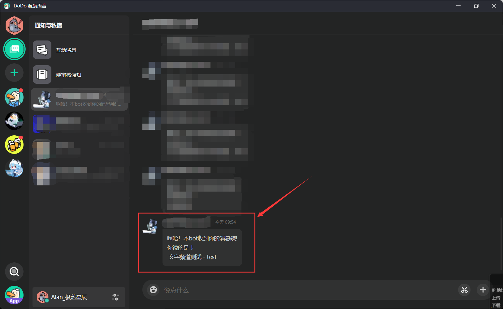

<p align="center">
  <a href="https://open.imdodo.com">
    
  </a>
</p>

<div align="center">

  # dodo-demo-Project

</div>

<div align="center">

  ### 让我们先从最简单的需求开始

</div>

### 一、需求一 - 复读机

#### 1.1 需求

​	做一个**复读机**。当检测到**文字频道**中发来的消息时，会将对应的消息通过**私信**发送给发送者。

#### 1.2 克隆 SDK 和一些准备工作

​	我们打开 SDK 的项目地址 -> [项目地址](https://github.com/AlanStar233/dodo-Python-SDK/) , 选择右上角的 "**code**" 按钮，点击 Download Zip。

​	或者你也可以选择通过 Git clone 命令来克隆 SDK。

​	我假定你已安装 **Git** 并进行了相关配置。就可以执行以下命令

```shell
git clone https://github.com/AlanStar233/dodo-Python-SDK.git
```

​	命令执行完成后，对应的文件将会被克隆到你的 terminal 所在的路径。

------

​	我们解压并打开 SDK 文件夹，将**所有文件**(可以不包含 ./docs 目录下的文件)，复制到你的**工程文件夹**的**根目录**下。

​	将你的工程文件夹用 IDE 打开，如果没有问题，结构应该如下图所示。

> 我创建的工程文件夹名为 **dodo-demo-Project**



#### 1.3 申请并填写机器人相关信息

​	如果你**没有申请过** dodo 机器人，请访问 [DoDo 开放平台](https://open.imdodo.com/) 根据引导完成认证，认证通过后可申请机器人，请务必保留好机器人的 **clientId** 与 **token** 信息。

​	

​	如果你准备好了上述数据，请打开工程文件夹下的 **./config/bot_Info.json** 文件，我已经为你预留好了需填写的字段，请填写在 **" "** 中。



#### 1.4 制作

​	我们打开工程文件夹下的 **./WebsocketConnection.py** 文件

​	转到第 **15** 行的 **on_message()** 部分

> **注：对应行数可能因为项目后续迭代而出现偏移，请以函数名为准**
>
> **注：如需了解整个文件中的所有函数，请移步至 SDK 项目对应文档 -> [链接](https://github.com/AlanStar233/dodo-Python-SDK/blob/main/docs/WebSocketConnection.md)**

​	这里是 WebSocket 接收到消息时做出的反应。 **message** 即通过 WebSocket 返回的信息。这是完成所有信息判断的**核心变量**之一。

​	接着我们看此部分

```python
message = str(message, "utf-8")
```

​	由于通过 WebSocket 返回来的 message 是**二进制字节流**，为了转换为可处理的信息，我们需要将其转换为 **utf-8** 编码的 **string** 型变量。

------

```python
message = message.strip("b").strip("'")
```

​	接上文，当 message 信息被转换为 string 后，这串信息仍有**二进制标志位**存在，需要我们去掉。二进制内容由 **b** 表示，并用**单引号**包括住信息。

> **注：此处因为未知原因，本可以使用 decode 方法来代替上两行代码，但使用后即报错。**

------

```python
print("[Get message]:", message)
```

​	打印一遍获得的信息，方便调试。(<s>应该不用解释吧</s>)

------

```python
message = json.loads(message)
```

​	我们将 message 用 **json.loads()** 方法转为 json 格式，方便变量提取。

> **注：如果你的 IDE 在 json 处划了红色下划线(也可能是其他形式)，是你没有导入 json 包**

------

​	下面的代码已为你写好，将 json 中的所有必要信息都进行了解析和赋值，使用即可。

​	如果你需要其他数据，请结合返回的**标准数据体**自行提取。这里是其中一个 case。

```json
{
	"type": 0,
	"data": {
		"eventBody": {
			"channelId": "11111",
			"dodoId": "11111",
			"islandId": "1111",
			"member": {
				"joinTime": "2022-01-01 00:00:00",
				"nickName": "啊啊啊啊"
			},
			"messageBody": {
				"content": "啊啊啊啊"
			},
			"messageId": "333333333333333",
			"messageType": 1,
			"personal": {
				"avatarUrl": "https://img.imdodo.com/caeeecb5fsdgergerdf43ad918b3.jpg",
				"nickName": "哦哦哦哦哦",
				"sex": 1
			},
			"reference": {
				"dodoId": "",
				"messageId": "",
				"nickName": ""
			}
		},
		"eventId": "8ac3d51n5rt1y5s8477b539a8a2c0",
		"eventType": "2001",
		"timestamp": 1660526431256
	}
}
```

------

​	我们转到 **43** 行。

```python
sendTime = datetime.fromtimestamp(timestamp / 1000.0).strftime("%Y{Y}%m{m}%d{d} %H:%M:%S").format(Y='年',m='月',d='日')
```

​	由于 dodo 使用了 **13** 位的时间戳，所以我们需要上述代码将时间戳转为标准时间格式。

> **注：这里舍弃了毫秒位，如需必要可自行添加。**

------

​	**47** - **55** 行为在控制台中打印监听到的信息。

```python
\033[92m[message]\033[0m
```

​	此处是**着色代码**，将 [message] 改为<font color="green">**绿色**</font>。

------

​	来到 **57** 行。

```python
reply_content = "啊哈！本bot收到你的消息辣!\n你说的是 ↓\n " + content
```

​	由于我们做的是复读机，所以我们在 **reply_content** 中需要将上面获取到的 **content** 发送给这条信息的发送者。这里将自定义文案和 **content** 拼接。

------

```python
SendPersonalMessage.send(dodoId=dodoId, messageType=1, content=reply_content)
```

​	这里调用了 **SendPersonalMessage** 库下的 **send()** 方法。功能为**发送私信**。

​	传入参数为 **dodoId**, **messageType**, **content**

​	由于我们发送的是**文字信息**(暂时不考虑图片、视频等其他形式)，所以**messageType** 为 1。

​	**此时，复读机的需求完成**。

#### 1.5 验证

​	我们可以打开 IDE 中提供的**运行**，将 **WebsocketConnection.py** 跑起来。

​	你也可以在工程文件夹下打开 **命令提示符**。输入如下命令

```shell
py ./WebsocketConnection.py
```

​	此时，程序将自动获取 WebSocket 地址的**获取**和**连接**，并等待**信息传回**。

​	我们在群里的文字频道随便发送一条消息。



​	我们看控制台，会有相关消息的监听通知。

> 如果你有看到红色的 [Heartbeat]，是为了保持长连接而发送的心跳包，不必恐慌。



​	我们转到私信，可以看到机器人按照我们的预期回复了你发送的内容。



​	到此，需求验证成功。

------

​	希望这个短短的教程能够帮到你，我们下一个教程见。
